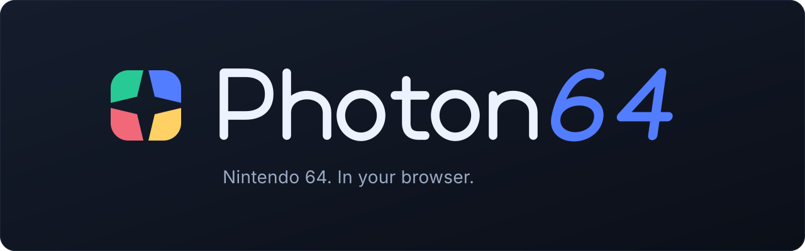
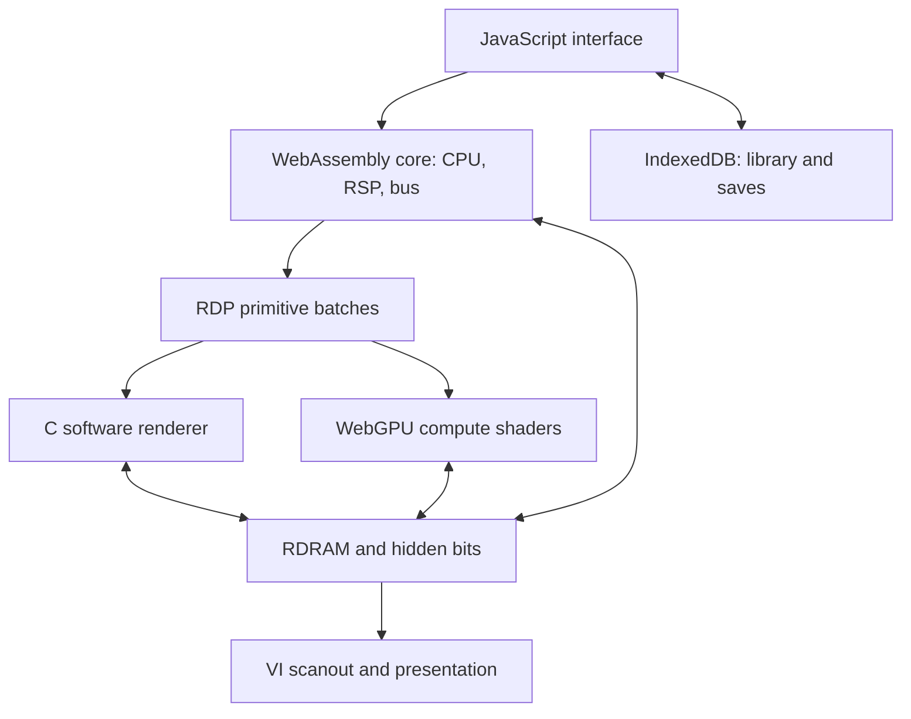

<p align="center">
  <strong>Your cartridges. Your browser. One HTML file.</strong>
</p>

<p align="center">
  <a href="https://github.com/PowerBeef/Photon64/actions/workflows/validate.yml"></a>
  <a href="LICENSE"></a>
  <a href="#under-the-hood"></a>
  <a href="#under-the-hood"></a>
</p>

<p align="center">
  <a href="#play">Play</a> ·
  <a href="#controls">Controls</a> ·
  <a href="#under-the-hood">Under the hood</a> ·
  <a href="#accuracy-and-project-status">Accuracy</a> ·
  <a href="#development">Development</a>
</p>

Photon64 is an experimental Nintendo 64 emulator that runs locally in your browser. A C core compiled to WebAssembly handles the console, while WebGPU compute shaders or a software renderer draw the picture. The core, interface, shaders, and artwork are bundled into **one self-contained HTML app**.

Open the app, add a cartridge dump, and return to it from your game library. No emulator installation, account, or backend is needed to play.

## Made for playing

| Feature | What you get |
|---|---|
| **A local game library** | Drag and drop a ROM or ZIP, with cartridge-style library cards and saved thumbnails. |
| **Flexible controls** | Remappable keyboard input, standard gamepads, and adjustable touch controls. |
| **Save your progress** | Battery saves, Controller Pak data, and four save-state slots; import and export game-save data. |
| **Choose your picture** | Native, 2×, and 4× GPU resolution where supported; console video filtering, scaling choices, and fullscreen. |
| **Choose your renderer** | WebGPU when a suitable adapter is available, with a C software fallback. |
| **Keep it portable** | One HTML file to run locally, with games and saves stored in your browser. |

## Play

### Get the app

**Use a CI build:** open the [validation runs](https://github.com/PowerBeef/Photon64/actions/workflows/validate.yml), choose a successful run for `main`, and download its **validation-evidence** artifact. Extract it and open `photon64.html`. GitHub may require you to sign in to download artifacts.

**Build your own:** follow [Building from source](#building-from-source) below. The output is `out/photon64.html`.

### Start a game

1. Open `photon64.html` in a modern browser with WebAssembly SIMD support.
2. Choose a cartridge dump or drop it onto the window. Supported formats are `.z64`, `.n64`, `.v64`, `.rom`, `.bin`, and `.zip`; byte order is detected automatically.
3. Play with the keyboard, a connected gamepad, or the on-screen pad. Press **Esc** to open the menu and change settings.

WebGPU is optional. If the browser cannot provide a suitable adapter, Photon64 uses software rendering. GPU availability, game speed, and higher resolutions depend on your browser and device.

The interface adapts to phones, tablets, desktop windows and ultrawide displays, with safe-area spacing and scrollable menus. See the [UI and browser review](UI_COMPATIBILITY.md) for the test matrix, observed results and remaining physical-device checks.

Bring your own cartridge dumps. **Commercial games are not included.** The repository's `testroms/` directory contains homebrew development fixtures.

<details>
<summary><strong>Local hosting and save backups</strong></summary>

If your browser restricts GPU or storage access when opening a local file, serve the built app from localhost:

```sh
python3 -m http.server 8000 --directory out
```

Then open <http://localhost:8000/photon64.html>.

Games, saves, and states belong to the browser storage for the address you use. Switching browser profiles or moving between a local file and localhost may give you a different library. Use **Settings → Data → Export save** to back up game-save data before clearing browser storage. If persistent storage is unavailable, the app labels the session as temporary.

Save states are tied to the core build and cartridge. A state from a different build can be rejected; keep game-save backups when upgrading.

</details>

## Controls

The keyboard layout is remappable in **Settings → Controls**. Save/load shortcuts and the menu key are fixed.

| N64 input / action | Default keyboard |
|---|---|
| Analog stick | Arrow keys |
| A / B | X / C |
| Z / Start | Z / Enter |
| L / R | Q / E |
| C buttons: up / down / left / right | I / K / J / L |
| D-pad: up / down / left / right | T / G / F / H |
| Walk / half stick tilt | Left Shift |
| Fast-forward | Hold Tab |
| Pause / resume | P |
| Save / load first state slot | F2 / F4 |
| Menu / back | Esc |

Standard gamepads use the left stick for movement and the right stick for C buttons. The menu provides save-state slots, reset, fullscreen, and a fast-forward toggle. Touch settings let you adjust the pad's size, height, opacity, and D-pad visibility.

## Under the hood

Photon64 pairs a freestanding C emulator with a JavaScript browser interface. Both rendering paths consume the same RDP primitive batches, which makes software/GPU comparisons reproducible.



| Component | Implementation |
|---|---|
| **CPU and memory** | VR4300 interpreter, exception handling, TLB translation, bus, and DMA in `src/cpu.c` and `src/bus.c`. |
| **Floating point** | Portable SoftFloat 3e arithmetic with guest rounding modes and a VR4300 exception/NaN/flush policy wrapper. |
| **Signal processor** | RSP scalar/vector execution in `src/rsp.c`. |
| **Rasterizer** | RDP command decoding, spans, texture state, coverage, blending, depth, key alpha, and retained pipeline feedback. |
| **GPU coherence** | WGSL compute pipelines with CPU/GPU ownership tracking, readback barriers, and ordered dispatch for dependent batches. |
| **Video and audio** | VI scanout/filtering and browser presentation; Web Audio output with queue management. |
| **Browser interface** | Vanilla JavaScript, IndexedDB persistence, keyboard/gamepad/touch input, and a bundled HTML template. |
| **Build** | Optimized freestanding WASM with SIMD128 and bulk-memory support; `tools/build.mjs` embeds the core, shaders, and scripts. |

Higher-resolution GPU rendering is a display enhancement. Exact validation currently targets native resolution and HD-at-1x with full backing storage; 2×/4× retained feedback remains approximate.

## Accuracy and project status

**Active development, with explicit test evidence.** Complete N64 compatibility and hardware accuracy remain development goals. The [validation report](VALIDATION_REPORT.md) records workloads, revisions, comparison policies, and remaining limits.

At the [`d741f41`](https://github.com/PowerBeef/Photon64/commit/d741f41bc4a8c562979df401a7310601dac98513) renderer milestone:

- **Five recorded native gameplay replays** complete with zero counted color, depth, or hidden-bit differences against the pinned Angrylion comparison profile.
- **21 selected GPU gameplay checkpoints** and native/HD-at-1x synthetic shader streams pass on Dawn/lavapipe.
- **All five raw homebrew fixture images match exactly.** Independent VI comparisons cover 475 active fields with zero RGB differences.
- **Hosted baseline, desktop browser, and mobile-emulated browser jobs pass** in [this validation run](https://github.com/PowerBeef/Photon64/actions/runs/38030322848).

<details>
<summary><strong>Recorded native renderer comparisons</strong></summary>

| Recorded scenario | VI fields | Counted color / depth / hidden differences |
|---|---:|---|
| Super Mario 64 | 4,200 | 0 / 0 / 0 |
| GoldenEye 007 | 4,600 | 0 / 0 / 0 |
| Mario Kart 64 | 3,300 | 0 / 0 / 0 |
| Perfect Dark | 6,500 | 0 / 0 / 0 |
| World Driver Championship | 16,762 | 0 / 0 / 0 |

These are bounded recorded scenarios, not whole-game compatibility ratings. The native oracle shares observed guest writes and uses reference-master memory synchronization, with random bits zeroed on both sides. GPU gameplay comparisons cover VI RGB, the last batch target, and three execution counters in checkpoint windows. Lavapipe is a software Vulkan adapter; mobile browser coverage is emulation, not physical phone testing.

The legacy mixed-stage screenshot comparator retains its original five failures as a visible CI diagnostic. Required fixture gates now compare exact raw output and independent VI output separately. See [renderer implementation notes](RENDERER_ACCURACY_IMPLEMENTATION.md) for the policy and coverage.

</details>

Current priorities are two-cycle boundary conformance, ordered-GPU performance, more TMEM/VI edge cases, broader CPU/FPU hardware vectors, and physical GPU/mobile/controller/audio testing. CPU PC/address handling remains 32-bit, CACHE is a no-op, and timing uses configurable constant CPI. The [implementation plan](IMPLEMENTATION_PLAN.md#next-implementation-order) tracks the next work.

## Development

### Building from source

The setup script supports **Linux x86_64 and macOS**. Install Git, Node.js 24+, Python 3.12 with venv support, and a native C compiler. macOS also needs Homebrew and Xcode Command Line Tools; setup installs LLVM/lld when needed.

```sh
git clone https://github.com/PowerBeef/Photon64.git
cd Photon64
tools/setup.sh
. out/env.sh
npm run build
```

Open **`out/photon64.html`** to play. Setup pins build/test dependencies and fetches a separate reference checkout; it does not download commercial games. For compiler overrides, reference locations, browser setup, and GPU adapters, see [DEVELOPMENT.md](DEVELOPMENT.md).

### Validation and debugging

After setup, use the required baseline:

```sh
. out/env.sh
npm run validate
```

It builds native/WASM/app outputs, runs JS regressions and sanitizer checks, tests the same core vectors in WASM O0/O3, and compares exact raw fixtures and independent VI output. No commercial cartridge, browser, or GPU is needed for this baseline.

| Task | Entry point |
|---|---|
| Frontend/GPU regressions | `npm test` after building the core |
| Browser persistence and lifecycle | `node tools/browsercheck.mjs testroms/RSPCP2VRCP.N64` with Playwright Chromium installed |
| Local commercial determinism | `npm run test:roms` with your fixtures in ignored `roms/` |
| Recorded reference/GPU replays | `tools/games.sh --check-roms`, then `GPU_RUNNER=dawn tools/games.sh` with the required adapter and cartridges |
| Interactive headless play/debug | `node tools/coreplay.mjs ROM` for JSON-line stepping, input, inspection, and PNG snapshots |
| Repeatable scene benchmarks | `npm run bench -- ROM --frames 4200 --warmup 3800 --inputs tools/inputs/sm64.txt --repeats 3` for a matching Mario scenario |

Benchmark results record the workload, timing distribution, and final hashes. Shared-host timings are measurements for that scenario, not physical-device FPS predictions. [Development instructions](DEVELOPMENT.md#gameplay-benchmarks-and-debugging) cover profiles, GPU traces, native image/audio capture, and complete replay commands.

<details>
<summary><strong>Source map</strong></summary>

| Path | Purpose |
|---|---|
| `src/n64.c` | Unity-build entry point for the C core. |
| `src/` | CPU, bus, RSP, RDP, VI, API, and GPU synchronization. |
| `src/web/` | Browser interface, art, controls, WGSL shaders, and HTML template. |
| `third_party/softfloat/` | Portable floating-point implementation and notices. |
| `tools/` | Builds, reference adapters, regression tests, benchmarks, and diagnostics. |
| `tools/inputs/` | Recorded controller sequences for reproducible scenarios. |
| `testroms/` | Homebrew fixtures and reference images. |
| `assets/` | Project-page artwork. |
| `roms/` | Ignored local commercial test inputs. |
| `out/` | Generated app, binaries, and evidence; ignored by git. |

</details>

## Contributing

Bug reports and focused fixes are welcome. [Open an issue](https://github.com/PowerBeef/Photon64/issues) with the build/commit, browser and OS, renderer, game revision, reproduction steps, and relevant logs or screenshots. Keep commercial ROM bytes out of issues and pull requests.

For code changes, follow [AGENTS.md](AGENTS.md), run the checks appropriate to the change, and describe both the result and its test coverage. Useful starting points:

| Document | Use it for |
|---|---|
| [Development guide](DEVELOPMENT.md) | Setup, commands, profiling, and reproduction. |
| [Validation report](VALIDATION_REPORT.md) | Executed results and their limits. |
| [Implementation plan](IMPLEMENTATION_PLAN.md) | Priorities and acceptance criteria. |
| [Renderer implementation](RENDERER_ACCURACY_IMPLEMENTATION.md) | Current rendering changes and comparison policy. |
| [Accuracy investigation](ACCURACY_INVESTIGATION.md) | Historical traces and diagnosis. |
| [Dependency and fixture provenance](THIRD_PARTY.md) | Versions, credits, notices, and unresolved provenance questions. |

## License and credits

Photon64's root license is **[MIT](LICENSE)**. Third-party materials carry their own notices; see [THIRD_PARTY.md](THIRD_PARTY.md).

Thanks to **Berkeley SoftFloat**, **Angrylion RDP Plus**, **parallel-RDP**, and **PeterLemon/krom's N64 tests** for the floating-point implementation, rendering references, and homebrew test work acknowledged in the code and provenance notes.
